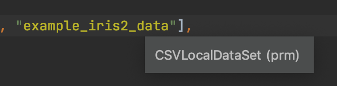
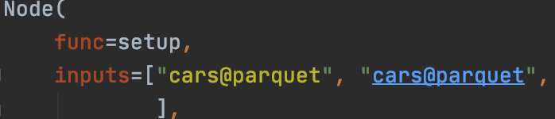
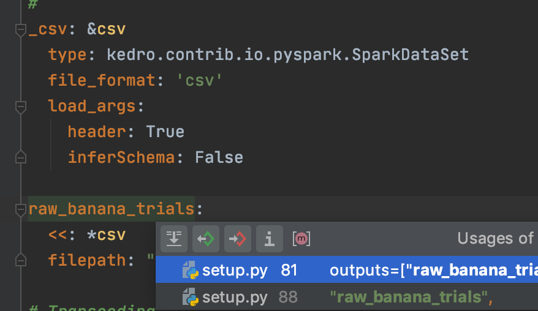

# Kedro PyCharm Plugin
> This a work in progress project and is in  a pre-alpha state

### Automatic suggestions for datasets:

- Provide suggestions as you declare dataset inputs or outputs

### Dataset parameter validity detection:

- Highlight datasets that are discovered in the catalog 
- Flag dataset declarations which do not correspond to a catalog entry 

### Tooltip for dataset information:

- Hover for relevant dataset metadata such as `Type` and `Layer`

### Jump to declaration:

- Use PyCharm to jump to the YAML declaration of a dataset reference

### Find usages from the catalog:

- Find declarations of datasets across your Kedro codebase from the catalog entry

